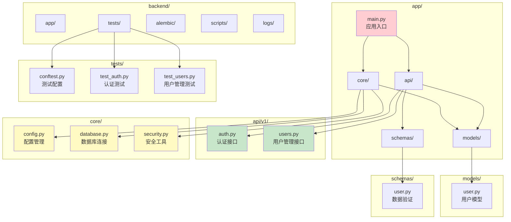
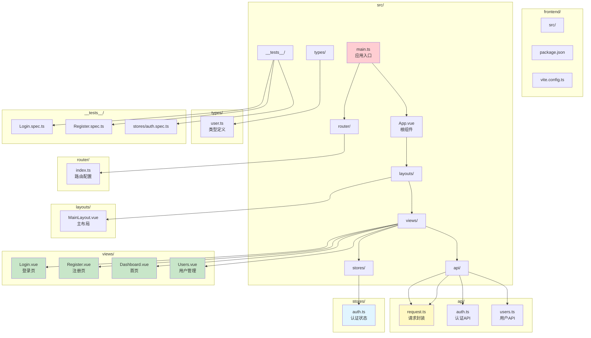
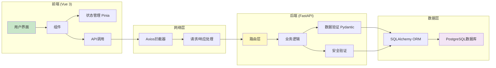
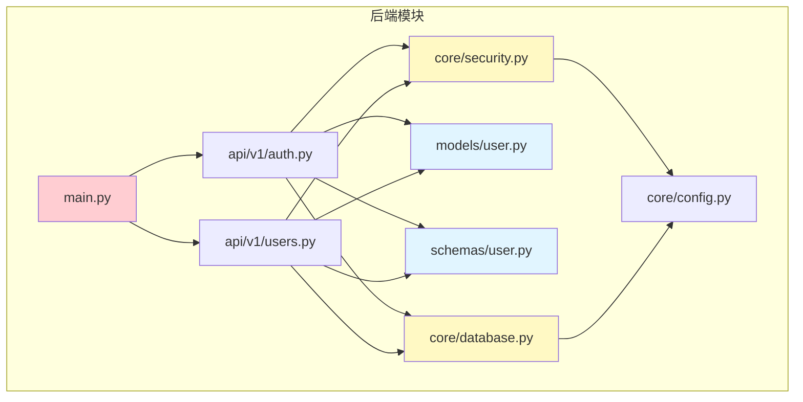
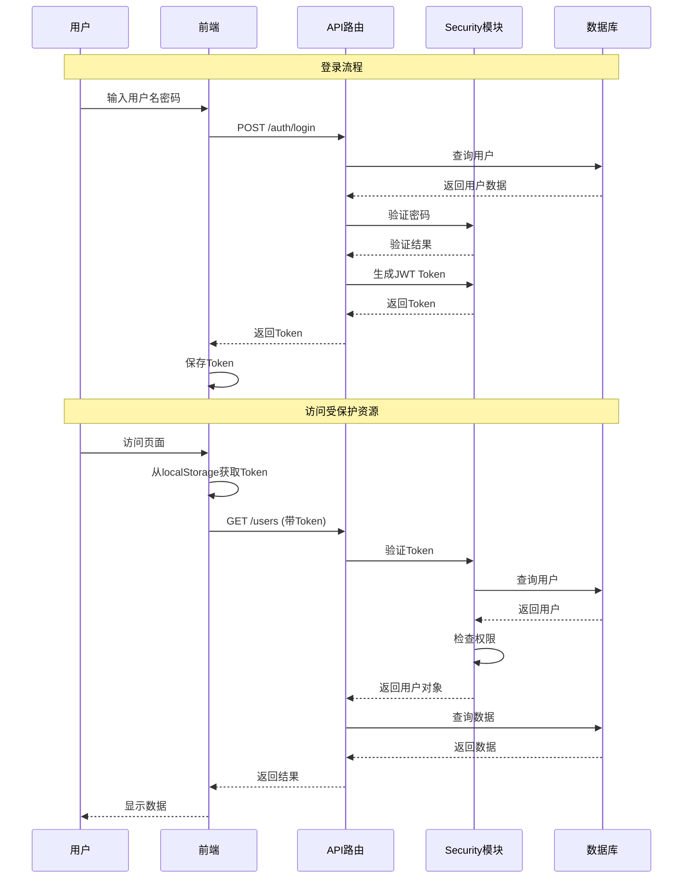
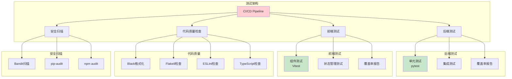
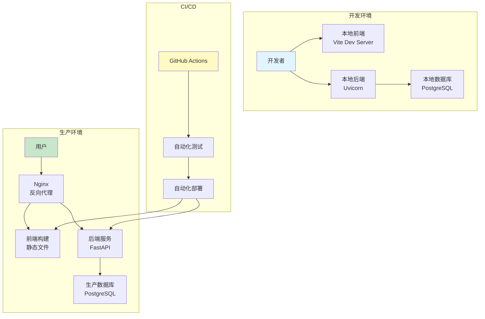
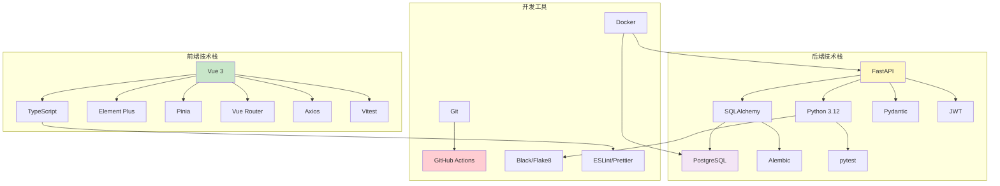

# 项目结构图

本文档包含项目的整体结构、模块关系和技术栈关系图，使用 Mermaid 图表格式。

## 1. 整体项目结构

```mermaid
graph TB
    subgraph "项目根目录 (cjh)"
        A[README.md]
        B[CHANGELOG.md]
        C[docker-compose.yml]
        D[.github/]
        E[backend/]
        F[frontend/]
        G[docs/]
    end
    
    D --> D1[workflows/ci.yml]
    D --> D2[ISSUE_TEMPLATE/]
    
    E --> E1[app/]
    E --> E2[tests/]
    E --> E3[alembic/]
    E --> E4[requirements.txt]
    
    F --> F1[src/]
    F --> F2[package.json]
    F --> F3[vite.config.ts]
    
    G --> G1[REQUIREMENTS.md]
    G --> G2[TEST_PLAN.md]
    G --> G3[API.md]
    G --> G4[PROJECT_MANAGEMENT.md]
    
    style A fill:#e1f5ff
    style E fill:#fff9c4
    style F fill:#c8e6c9
    style G fill:#f3e5f5
```



## 2. 后端结构图



## 3. 前端结构图



## 4. 数据流图



## 5. 模块依赖关系图



## 6. 认证授权流程图



## 7. 测试结构图



## 8. 部署架构图



## 9. 技术栈关系图



## 10. 目录树结构（文本格式）

```
cjh/
├── .github/                    # GitHub配置
│   ├── workflows/              # CI/CD工作流
│   │   └── ci.yml             # 持续集成配置
│   └── ISSUE_TEMPLATE/        # Issue模板
│       ├── bug_report.md
│       └── feature_request.md
│
├── backend/                    # 后端代码
│   ├── app/                    # 应用主目录
│   │   ├── api/               # API路由
│   │   │   └── v1/
│   │   │       ├── auth.py    # 认证接口
│   │   │       └── users.py   # 用户管理接口
│   │   ├── core/              # 核心功能
│   │   │   ├── config.py     # 配置管理
│   │   │   ├── database.py   # 数据库连接
│   │   │   └── security.py   # 安全工具
│   │   ├── models/            # 数据模型
│   │   │   └── user.py       # 用户模型
│   │   ├── schemas/           # 数据验证
│   │   │   └── user.py       # 用户验证
│   │   └── main.py            # 应用入口
│   ├── tests/                 # 测试代码
│   │   ├── conftest.py       # 测试配置
│   │   ├── test_auth.py      # 认证测试
│   │   └── test_users.py     # 用户管理测试
│   ├── alembic/               # 数据库迁移
│   │   ├── versions/         # 迁移版本
│   │   └── env.py            # 迁移环境
│   ├── scripts/               # 工具脚本
│   │   └── init_db.py        # 数据库初始化
│   ├── logs/                  # 日志文件
│   ├── requirements.txt       # Python依赖
│   └── Dockerfile             # Docker配置
│
├── frontend/                   # 前端代码
│   ├── src/                   # 源代码
│   │   ├── api/              # API调用
│   │   │   ├── request.ts    # 请求封装
│   │   │   ├── auth.ts       # 认证API
│   │   │   └── users.ts      # 用户API
│   │   ├── views/            # 页面组件
│   │   │   ├── Login.vue     # 登录页
│   │   │   ├── Register.vue  # 注册页
│   │   │   ├── Dashboard.vue # 首页
│   │   │   └── Users.vue     # 用户管理
│   │   ├── stores/           # 状态管理
│   │   │   └── auth.ts       # 认证状态
│   │   ├── router/           # 路由配置
│   │   │   └── index.ts      # 路由定义
│   │   ├── layouts/          # 布局组件
│   │   │   └── MainLayout.vue
│   │   ├── types/            # 类型定义
│   │   │   └── user.ts
│   │   ├── __tests__/        # 测试文件
│   │   │   ├── Login.spec.ts
│   │   │   ├── Register.spec.ts
│   │   │   └── stores/
│   │   ├── App.vue            # 根组件
│   │   └── main.ts           # 入口文件
│   ├── package.json          # 项目配置
│   └── vite.config.ts        # Vite配置
│
├── docs/                      # 项目文档
│   ├── REQUIREMENTS.md       # 需求文档
│   ├── TEST_PLAN.md         # 测试计划
│   ├── API.md               # API文档
│   ├── DEPLOYMENT.md        # 部署文档
│   ├── PROJECT_MANAGEMENT.md # 项目管理
│   ├── USER_FLOW_DIAGRAMS.md # 用户流程图
│   └── PROJECT_STRUCTURE.md # 项目结构图
│
├── docker-compose.yml         # Docker编排
├── README.md                  # 项目说明
└── CHANGELOG.md              # 更新日志
```

## 11. 路由结构图

```mermaid
graph TD
    A[应用入口] --> B{路由守卫}
    B -->|未登录| C[/login 登录页]
    B -->|已登录| D[主布局]
    
    C --> E[/register 注册页]
    E --> C
    
    D --> F[/ 首页 Dashboard]
    D --> G[/users 用户管理]
    
    G -->|管理员| H[显示用户列表]
    G -->|普通用户| I[跳转到首页]
    
    H --> J[创建用户]
    H --> K[删除用户]
    H --> L[查看统计]
    
    style C fill:#fff9c4
    style E fill:#fff9c4
    style F fill:#c8e6c9
    style H fill:#c8e6c9
    style I fill:#ffcdd2
```

## 12. 状态管理结构图

```mermaid
graph TB
    A[Pinia Store] --> B[auth Store]
    
    B --> C[token: string | null]
    B --> D[user: User | null]
    B --> E[isAuthenticated: computed]
    B --> F[loginUser: function]
    B --> G[fetchUserInfo: function]
    B --> H[logout: function]
    
    F --> I[调用 login API]
    I --> J[保存 Token]
    J --> G
    
    G --> K[调用 getCurrentUser API]
    K --> D
    
    H --> L[清除 Token]
    H --> M[清除 User]
    
    style B fill:#e1f5ff
    style C fill:#fff9c4
    style D fill:#fff9c4
    style E fill:#c8e6c9
```

## 图表说明

### 颜色含义
- **蓝色 (#e1f5ff)**: 入口或核心模块
- **绿色 (#c8e6c9)**: 功能模块或成功状态
- **黄色 (#fff9c4)**: 配置或工具模块
- **红色 (#ffcdd2)**: 错误处理或异常流程
- **紫色 (#f3e5f5)**: 数据存储或数据库

### 查看方式
1. **GitHub/GitLab**: 直接查看，Mermaid图表会自动渲染
2. **VS Code**: 安装 "Markdown Preview Mermaid Support" 扩展
3. **在线查看**: 访问 https://mermaid.live/ 粘贴代码查看
4. **导出图片**: 使用 mermaid-cli 或在线工具导出为 PNG/SVG

### 更新说明
- 项目结构会根据实际代码更新而更新
- 新增模块时请在此文档中添加相应图表
- 保持图表与实际代码结构一致


