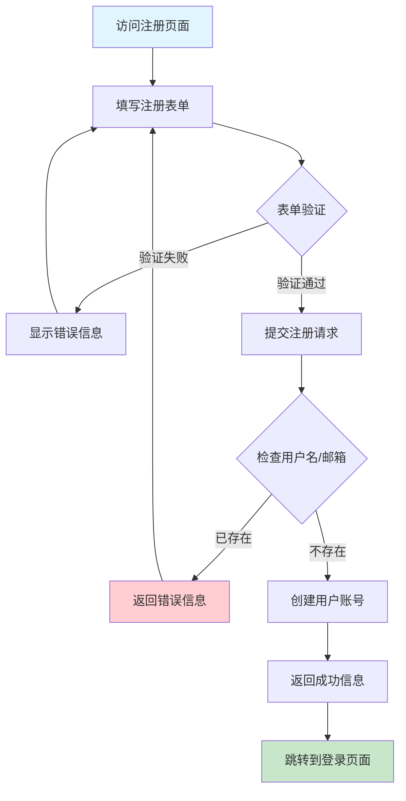
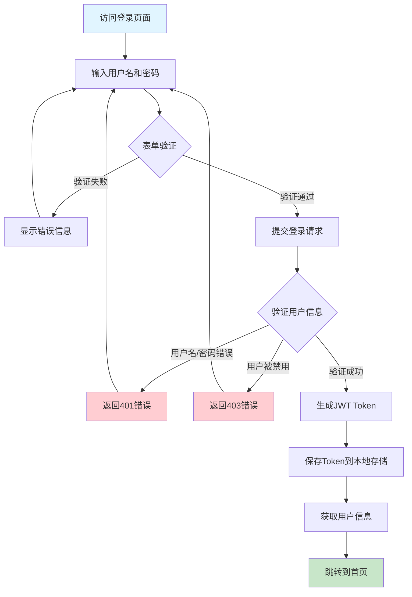
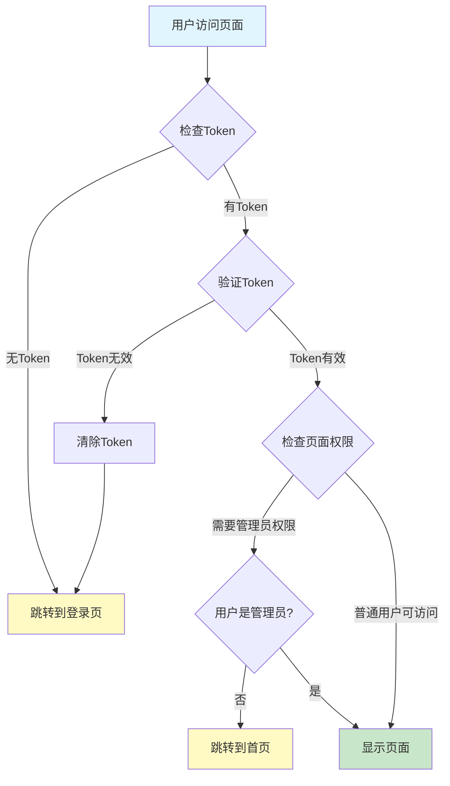
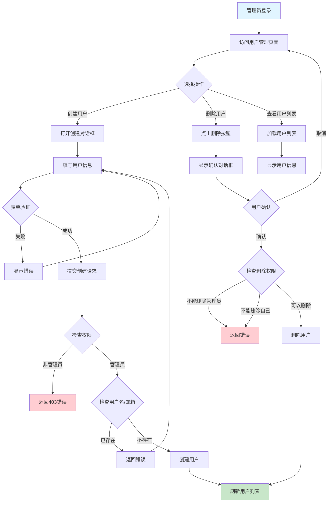
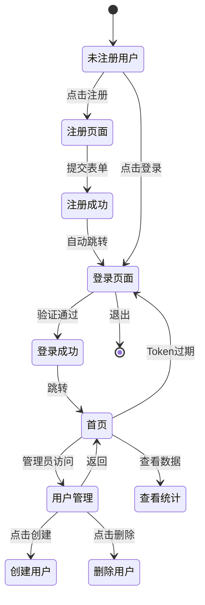
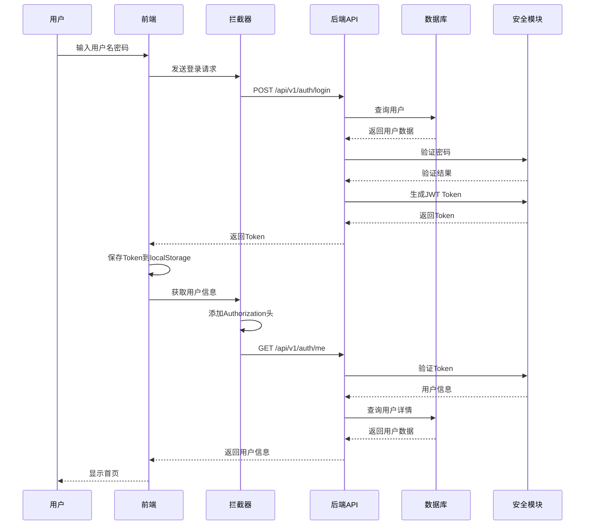
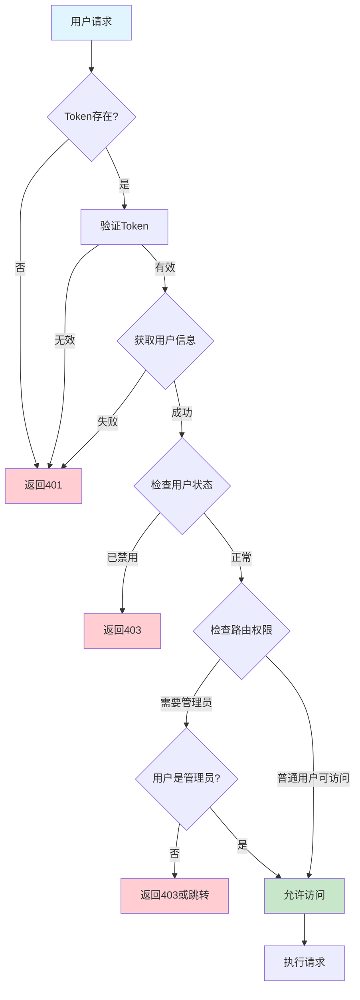
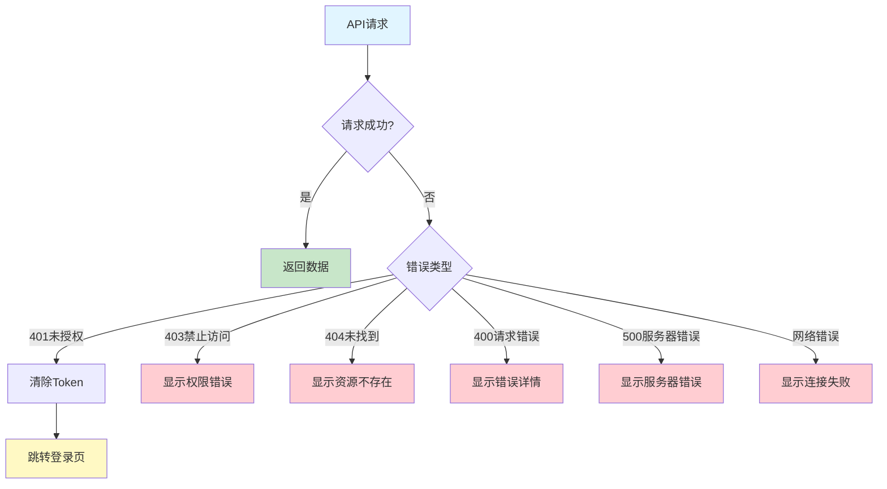
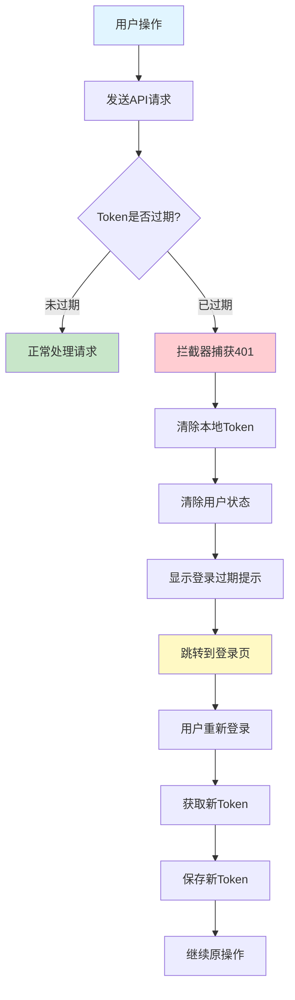
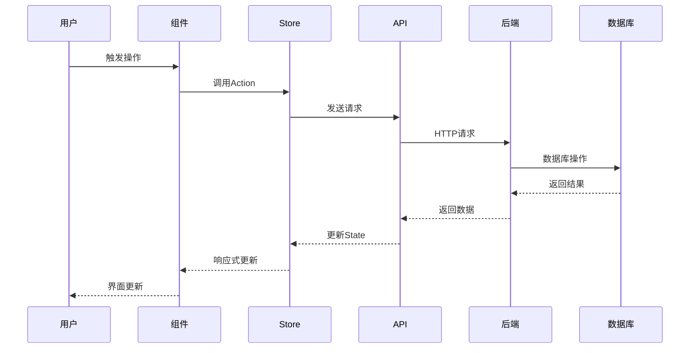

# 用户流程图

本文档包含系统的各种用户流程图，使用 Mermaid 图表格式，可在 GitHub/GitLab 等平台自动渲染。

## 1. 用户注册流程

## 2. 用户登录流程

## 3. 用户访问受保护页面流程

## 4. 管理员用户管理流程

## 5. 完整用户旅程图

## 6. API请求流程

## 7. 权限控制流程

## 8. 错误处理流程

## 9. Token刷新流程

## 10. 数据同步流程

## 图表说明

### 颜色含义
- **蓝色 (#e1f5ff)**: 起始节点或用户操作
- **绿色 (#c8e6c9)**: 成功状态或正常流程
- **黄色 (#fff9c4)**: 警告或跳转状态
- **红色 (#ffcdd2)**: 错误状态或异常流程

### 查看方式
1. **GitHub/GitLab**: 直接查看，Mermaid图表会自动渲染
2. **VS Code**: 安装 "Markdown Preview Mermaid Support" 扩展
3. **在线查看**: 访问 https://mermaid.live/ 粘贴代码查看
4. **导出图片**: 使用 mermaid-cli 或在线工具导出为 PNG/SVG

### 更新说明
- 流程图会根据系统功能更新而更新
- 如有新的用户流程，请在此文档中添加
- 保持流程图与实际代码逻辑一致

